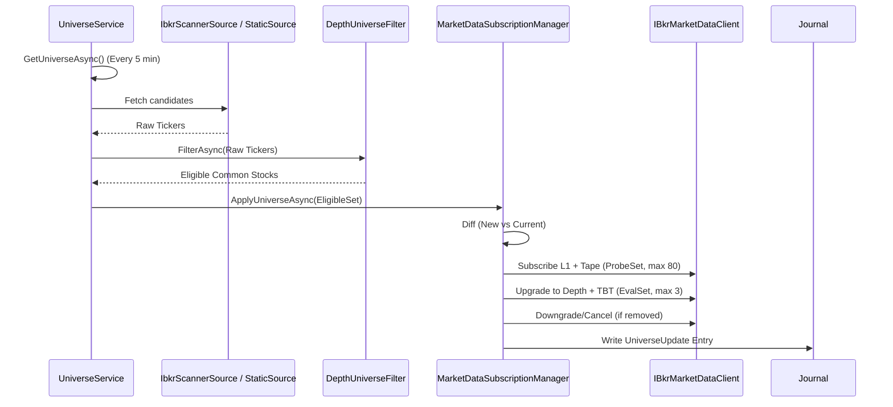
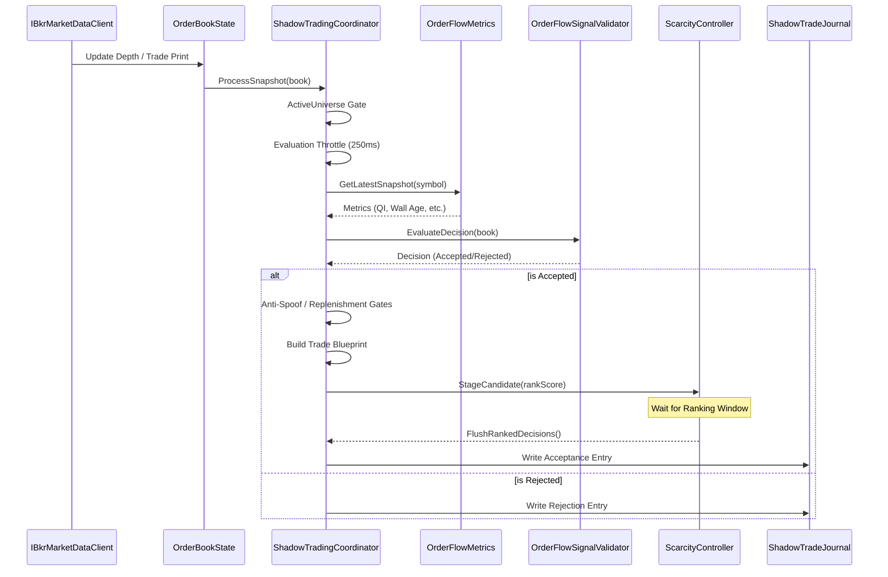
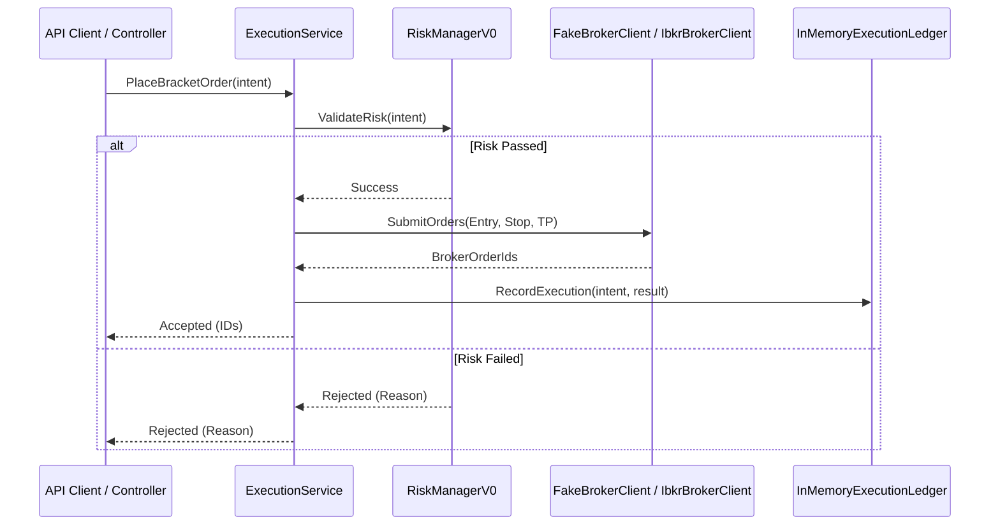
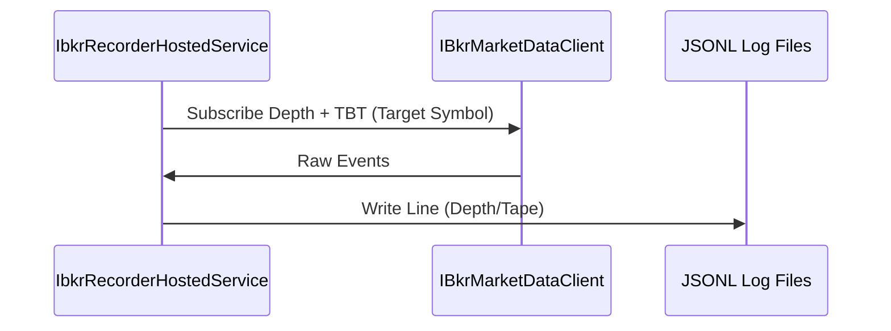
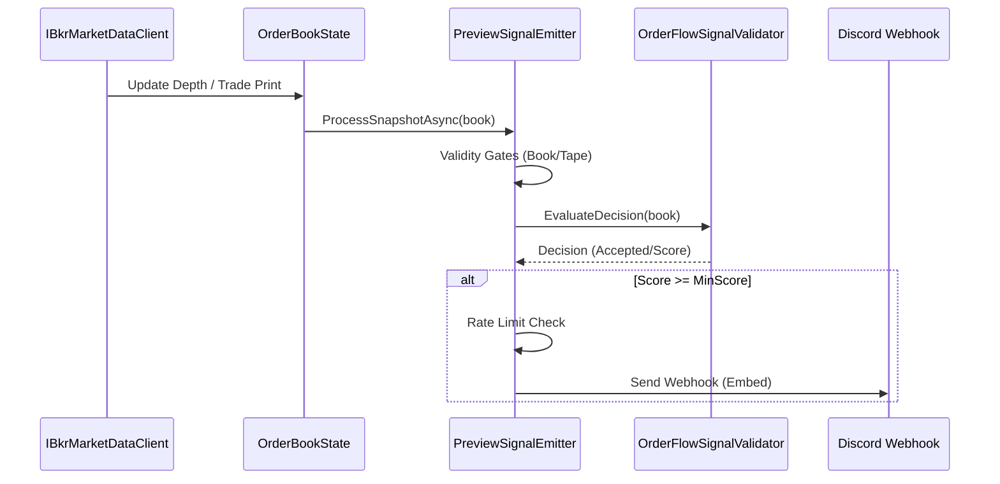

# RamStockAlerts – Core System Flows

This document outlines the high-level sequence diagrams for the primary operations of the RamStockAlerts platform.

## 1. Universe Pipeline & Subscription Management

This flow describes how the system discovers candidates and manages IBKR market data subscriptions.



## 2. Signal Loop (Real-Time Analysis)

This flow describes how market data is processed to detect signals and journal them.



## 3. Order Execution Flow

This flow describes how manual or automated orders are processed through the execution module.



## 4. Record & Replay Modes

### Record Mode


### Replay Mode
```mermaid
sequenceDiagram
    participant Replayer as IbkrReplayHostedService
    participant File as JSONL Log Files
    participant OBS as OrderBookState
    participant STC as ShadowTradingCoordinator

    Replayer->>File: Read Events
    Replayer->>OBS: Reconstruct State
    Replayer->>STC: ProcessSnapshot(book)
    STC->>Journal: Output to replay-output.txt

## 5. Daily Rollup & Outcome Pipeline

This flow describes how the journal is processed to aggregate metrics and label trade outcomes.

```mermaid
sequenceDiagram
    participant CLI as Program (MODE=report)
    participant DRR as DailyRollupReporter
    participant RS as RollupStats
    participant OTL as TradeOutcomeLabeler
    participant Store as FileOutcomeSummaryStore
    participant Journal as ShadowTradeJournal (JSONL)

    CLI->>DRR: RunAsync(journalPath)
    DRR->>Journal: Read Entries
    Journal-->>DRR: Entries (Signal/UniverseUpdate)
    loop For each Entry
        DRR->>RS: Record(entry)
    end

    DRR->>OTL: LabelOutcomesAsync(Accepted Entries)
    OTL-->>DRR: TradeOutcomes (Win/Loss/Open)

    DRR->>Store: AppendOutcomesAsync(outcomes)
    DRR->>RS: RecordOutcome(outcome)

    DRR->>RS: Render()
    RS-->>CLI: Final Report (Text/File)
```

## 6. Preview Signal Flow

This flow describes how "Preview" mode provides immediate Discord alerts for high-confidence setups without the full gating constraints.


```
# RamStockAlerts – Local Runbook (Windows)

This document describes how to run RamStockAlerts continuously on Windows
while allowing active development, branching, and parallel builds.

## Core Principle

Never run the app from the working git directory.

Always run from a published output folder to avoid:
- file locks
- accidental binary overwrites
- branch switches affecting a running process

---

## Folder Layout

C:\workspace\RamStockAlerts\        # Git working directory (dev only)
C:\run\RamStockAlerts\signals\      # Stable running instance
C:\run\RamStockAlerts\dev\          # Test / next build (optional)

---

## Build & Run (Stable Instance)

### Publish Release Build
Creates a self-contained output folder that will not change while running.

```powershell
dotnet publish -c Release -o C:\run\RamStockAlerts\signals

$env:Report__ExecutionDailyRollup="true"
